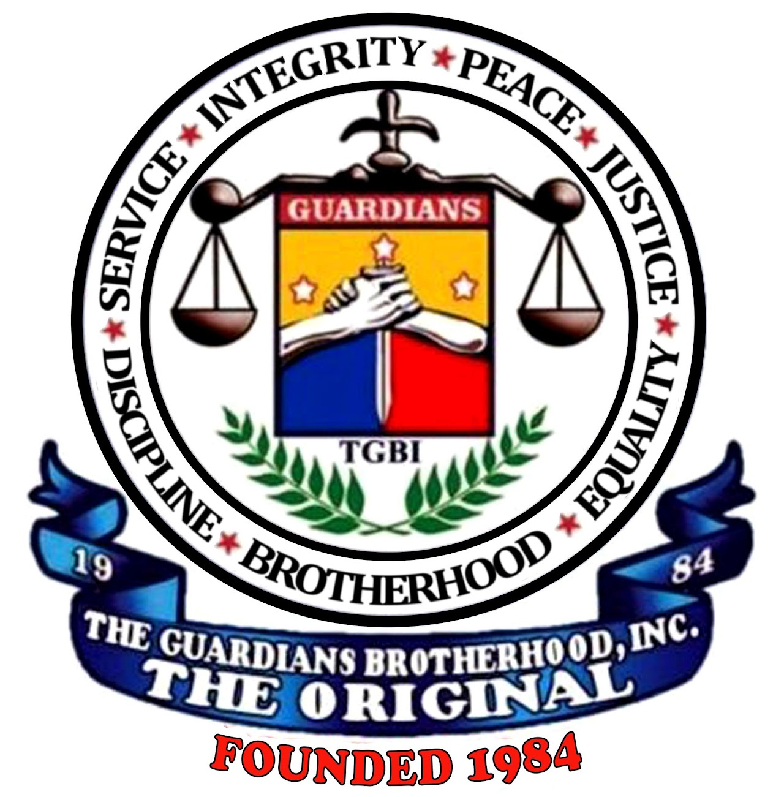

  

# THE GUARDIANS BROTHERHOOD, INC. - THE ORIGINAL (TGBI-TO)
## Official Repository of the International Organization

Welcome to the centralized repository of **The Guardians Brotherhood Incorporated - The Original (TGBI-TO)**. This digital space is created to store constitutional documents, training programs, standardized forms, maintain records of regional chapters, and develop web resources for our organization.

The repository is maintained under the strict supervision of the International Council to strengthen unity, transparency, and effective service to the community.

---

## 📌 About Our Organization

* **Official Name:** THE GUARDIANS BROTHERHOOD, INC. (with legal identifier **"The Original"** or **"TO"** to distinguish from later factions and other groups).
* **SEC Registration:** No. 123899 dated December 10, 1984 (registered as a non-profit, non-stock organization).
* **Official Motto:** *Brotherhood for peace and prosperity*.

### Meaning of the GUARDIANS Acronym:
* **G** — Gentlemen
* **U** — United
* **A** — Associates
* **R** — Race (Filipino Race)
* **D** — Dauntless
* **I** — Ingenious
* **A** — Advocators
* **N** — Nation
* **S** — Society

> *Filipino translation:* "Mga Maginoo, Nagkakaisang Katuwang Ng Lahing Filipino, Magigiting at Matapat na Tagapagtanggol ng Bansa at Lipunan".

### 7 Guiding Principles
These are the foundation of our identity, embedded in the organization's Code of Ethics:
1. **Brotherhood**
2. **Integrity**
3. **Peace**
4. **Discipline**
5. **Service**
6. **Equality**
7. **Justice**

---

## 📜 Brief History and Origins

The movement began in the jungles of Mindanao as the military unit **Diablo Squad** (1976), founded by the legendary **LEBORIO JANGAO JR.** (known as **"BFG ABRAHAM"** — the Brain and Father of all GUARDIANS). It later evolved into *Diablo Squad Crime Buster (DSCB)*. In November 1984, the Deputy Chief of Staff of the Armed Forces of the Philippines (AFP), Lieutenant General Fidel V. Ramos, ordered the disbandment of DSCB but gave his blessing to transform the group into a peaceful civil-military legal organization — thus **The Guardians Brotherhood, Inc. (TGBI)** was born.

Today, under the firm leadership of International Chairman **UPMF CARLOMAGNO**, one of the original founders of 1984, the organization is implementing reforms aimed at returning to its roots, eradicating internal disputes, and uniting true brothers and sisters.

---

## 🏢 International Headquarters and Leadership

* **General Headquarters (GHQ):**
  43-A Pangasinan St., Bago Bantay, Quezon City, 1105 Philippines.
* **Office of the International Chairman (OIC):**
  8500 Boyne Street, Downey, California 90242, USA.
* **International Chairman / Founder:**
  **ELPIDIO “UPMF CARLOMAGNO” SELETARIA JR., LLB.**

---

## 📂 Repository Structure Overview

* `assets/` — Logos, official fonts, and media (Guardians Creed, Prayer, Song).
* `docs/cbl/` — Current Amended Constitution and By-Laws.
* `docs/mbc/` — Mandatory Basic Course (POI) materials consisting of 12 hours of training.
* `docs/legal/` — Compliance documents (including Anti-Hazing Law RA 8049).
* `docs/forms/` — Form templates for membership, oath-taking, chartering, and rank promotion applications.
* `regions/` — Registry of regional, provincial, and local (barangay) chapters in accordance with the official structure of the Supreme Council.

---
*Mabuhay ang TGBI - The Original! We serve with pride and honor, we lead with purpose, we stand as one.*
